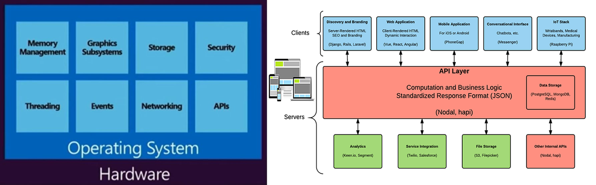

#### В репозитории собраны исходные коды несложных программ и модулей, которые написал сам или использовал существующие, в веб-разработке.

## Разделы:

- [Web_development](#web-dev)
- [Server](#server)
- [Desktop](#desktop)
- [Mobile](#mobile)

 
---
 

## Web_development
Создание веб-сайта или веб-приложения. Основными этапами процесса являются *веб-дизайн*, *вёрстка веб-страниц*, *программирование для веб на стороне клиента*.

- [Завершённые проекты](./web-development/projects-done)
- [Компоненты пользовательского интерфейса](./web-development/ui)
- [Инструменты](./web-development/tools)
- [Ссылки, полезная информация](./web-development/links.md)

 
---
 

## Server
Программирование на стороне и сервера. Архитектура приложения, взаимодействие с базой данных - сохраннение, сортировка данных.

- [Структуры данных, реализованные на javascript](./server/itsy-bitsy-data-structures-master)
- [Пример парснга *.csv файлов и вывода данных на страницу](./server/parsing-csv)
- [Парсинг любой html страницы, используя прокси-сервер](./server/parce.html)
- [VueJS 2.0, Express, and Passport](./server/vuejs2-authentication)
- [Инструменты](./server/tools)

**Rest API**

- [Rest-api client](./server/rest-api)
- [Sample project for jsgrid with ExpressJS REST service](https://github.com/tabalinas/jsgrid-express)
- [Simple pure JavaScript REST API client](https://github.com/Amareis/another-rest-client)
- [A set of Node Tasklist APIs which explores some databases and web frameworks](https://github.com/caio-ribeiro-pereira/node-api-examples)

**Полезные ссылки**

- [Awesome Node.js](https://github.com/dypsilon/awesome-nodejs)
- [Awesome Sysadmin](https://github.com/dypsilon/awesome-sysadmin)

 
---
 

## Desktop
Примеры приложений для десктопа

- [Electron, VueJs, and Firebase](./desktop/bookmarking-app-electron-vuejs-firebase)
- [Нативные приложения из вэб-сайта](https://www.npmjs.com/package/nativefier)

 
---
 

## Mobile
:

- 

