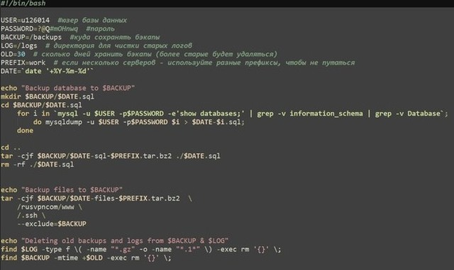
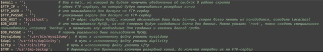

# Содержание:

---

- [**Элементарный Bash скрипт для резервного копирования данных**](./backup-sh.zip)

*Бекапит бд mysql и ложит на сервер в архиве*

---

---

- [**Продвинутый Perl скрипт,  для резервного копирования и восстановления данных**]()

---

