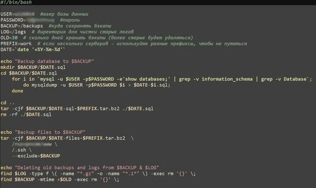
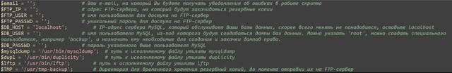

## Скрипты для резервного копирования

 
 

- [**Элементарный Bash скрипт для резервного копирования данных**](./backup-sh.zip)

 
---
 

- [**Продвинутый Perl скрипт,  для резервного копирования и восстановления данных**](./perl-backup.zip)

#### [Перейти в начало](https://github.com/tsvetkovpro/sources#server)

