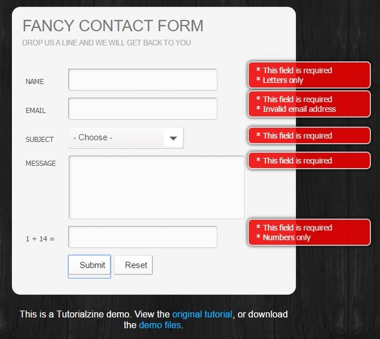

# Содержание:

- [Архивы проектов](./archive)

- [Ссылки](./examples/links.md)

- [Инструменты - tools](./archive/tools.md)

---

- [Демо контакты](./examples/demo-contact)

---

- [Rest-api client](./examples/rest-api)

*Simple pure JavaScript REST API client that makes your code lesser and more beautiful than without it.*

---

- [Парсинг *.csv](./examples/parsing-csv)

**Пример парсинга данных из excel и построение html-таблицы из них**

---

- [Парсинг html страницы](./examples/parce.html)

**Пример простого парсинга**

---

- [Php скрипт обратной связи](./examples/feedback.zip)

---

- [Калькулятор пластиковых окон на js](./examples/js-windows-cost-calculator.zip)

---

- [Мини-корзина](./examples/minibasket-master.zip)

---