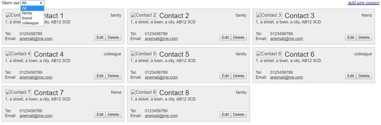
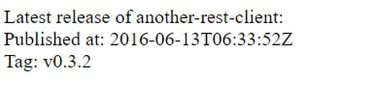
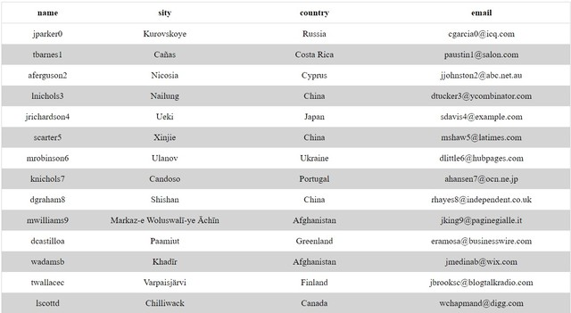
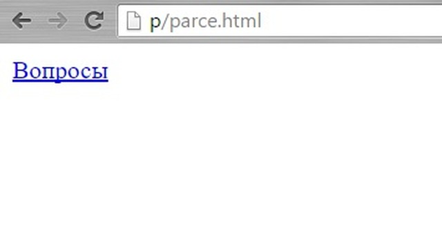
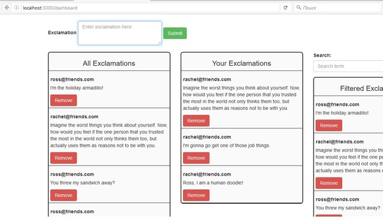
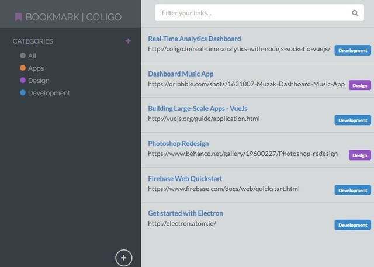
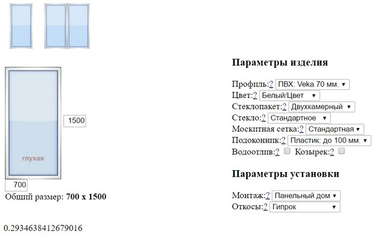

# Содержание:

1. #### [Архивы проектов](./archive)

2. #### [Ссылки](./examples/links.md)

---

- [Книга контактов](./examples/demo-contact)

---

- [Rest-api client](./examples/rest-api)

*Чистый JavaScript REST API клиент*

---

- [Пример парснга *.csv файлов](./examples/parsing-csv)

**Пример парсинга данных из excel и построение html-таблицы из них**

---

- [Парсинг html страницы](./examples/parce.html)

**Пример простого парсинга и вывода данных**

---

- [VueJS 2.0, Express, and Passport](./examples/vuejs2-authentication)

**Пример авторизации на nodeJS**

---

---

- [Electron, VueJs, and Firebase](./examples/bookmarking-app-electron-vuejs-firebase.zip)

**Пример приложения для управления закладками**

---

- [Калькулятор пластиковых окон на js](./examples/js-windows-cost-calculator.zip)

---

- [Мини-корзина](./examples/minibasket-master.zip)

---