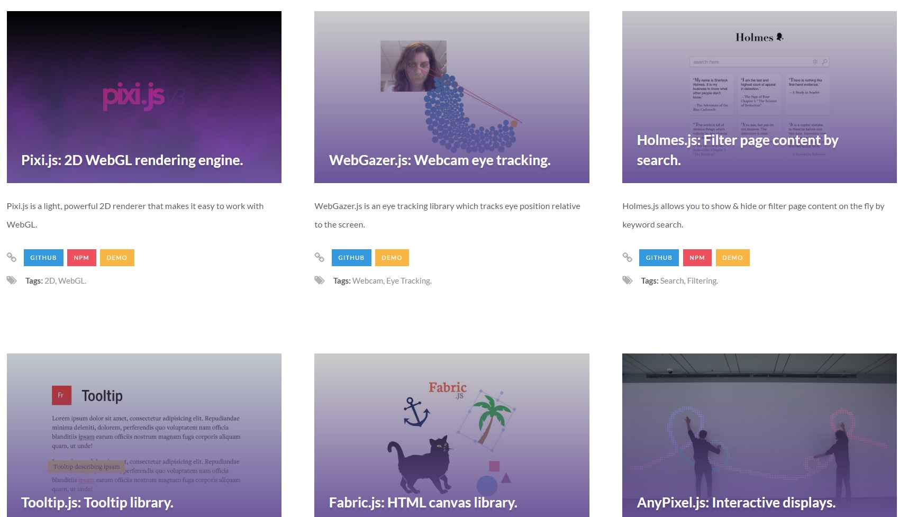
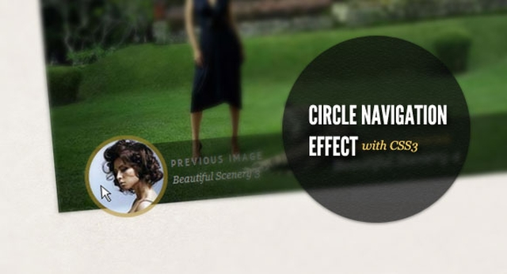
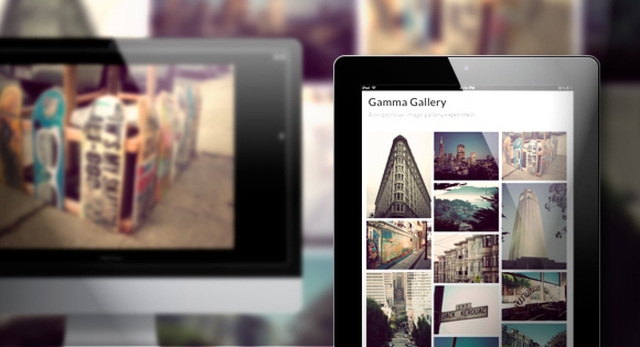
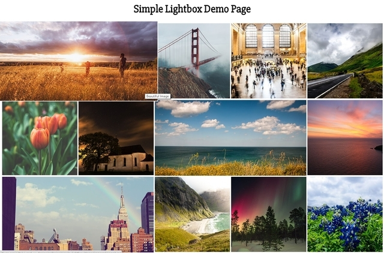
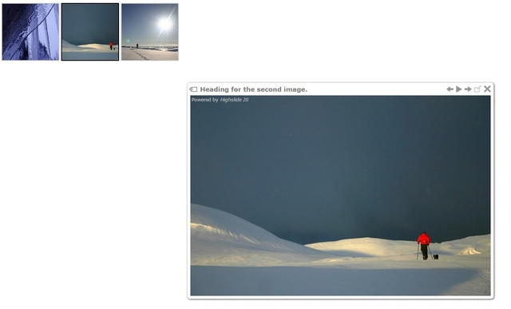
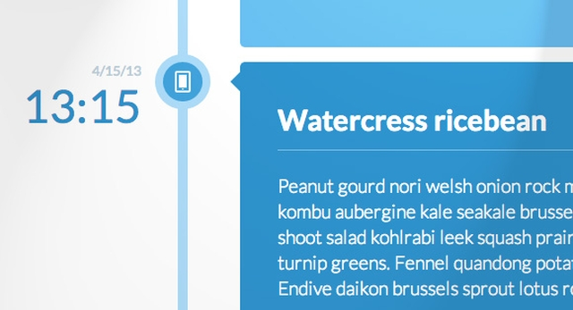
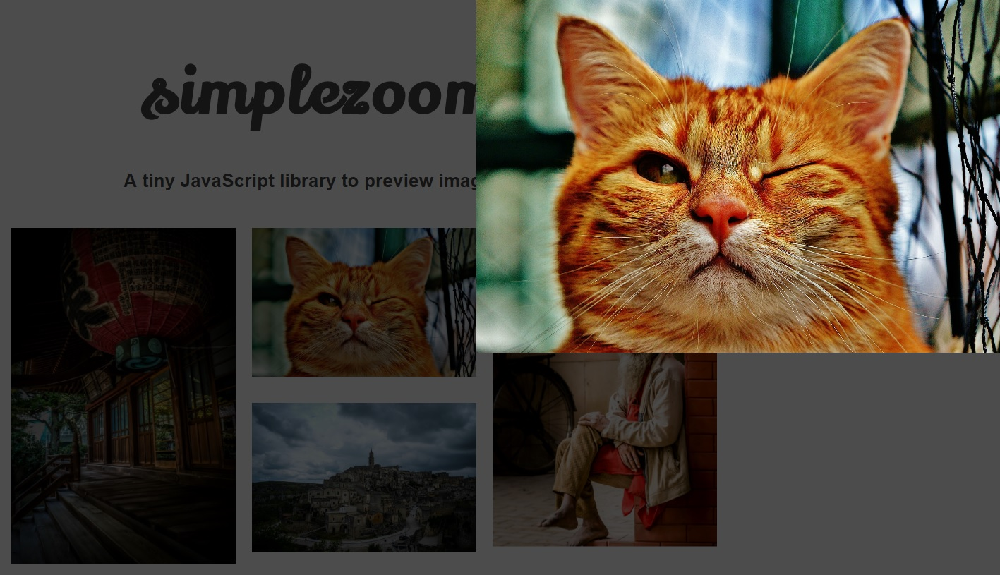

# Содержание:

 

---

1. [Обыкновенный JavaScript репозиторий](http://www.vanillalist.com/)

*Потому что иногда лучше без jQuery*

---

1. [Эффект круговой навигации с CSS3](./circle-navigation-effect.zip)

---

2. [Гамма галерея](./gamma-gallery.zip)

---

3. [Панорама](./panorama.zip)

*Стройтельство блоков виртуальной реальности в вэб. работает на ПК, iOS, Android, очках виртуальной реальности Oculus Rift.* [Ссылка на проект](https://aframe.io/)

---

4. [Простая галлерея](./simple-lightbox.zip)

*Дружественная к мобильным устройствам галлерея, с jQuery*

---

5. [D3.js - визуализация карты](./d3js-map-visualization.zip)

---

6. [Highslide JS](./high-slide.zip)

*Медиа галлерея написанная на JavaScript*

---

7. [Сравнение продуктов](./product-comparison.zip)

---

8. [Интерективные интерьер](./room-display.zip)

---

9. [Миниатюрная сетка с расширенным просмотром](./thumbnail-grid-expanding-preview.zip)

---

10. [Вертикальная временная шкала](./vertical-timeline.zip)

---

11. [20 jQuery слайдеров](http://code.tutsplus.com/tutorials/20-useful-jquery-sliders--cms-25960)

---

1. [Carousel (без JS)](https://github.com/DizzyZane/carousel-css)

")

---

1. [Simplezoom.js](https://github.com/chinchang/simplezoom.js)

*Маленькая JavaScript библиотека для превью картинок*

---

1. [Lightgallery.js](https://sachinchoolur.github.io/lightgallery.js/)

*JavaScript галлерея, с полным набором возможностей, без зависимостей*

---

