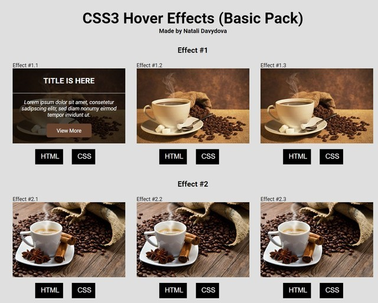
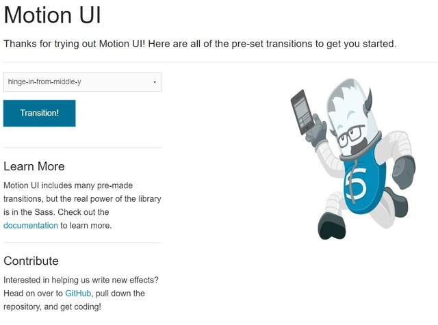
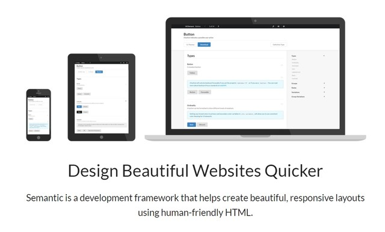
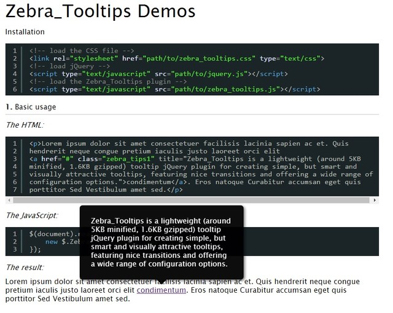
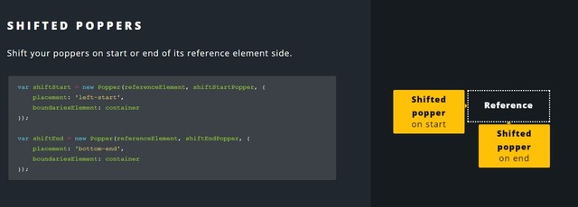
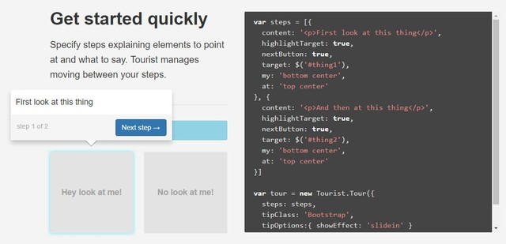
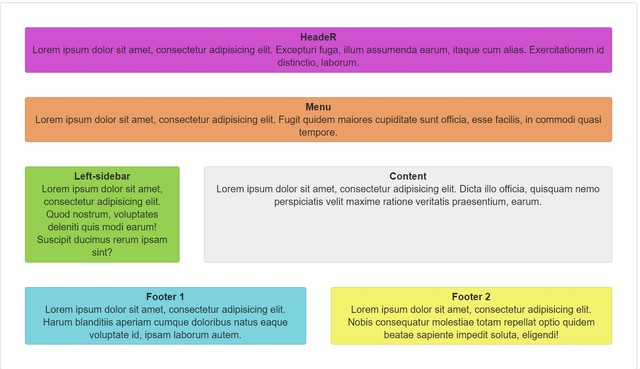
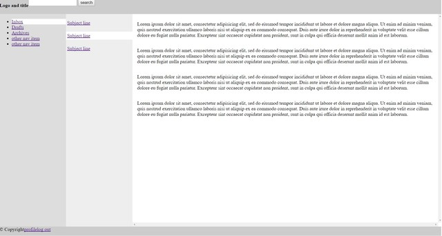
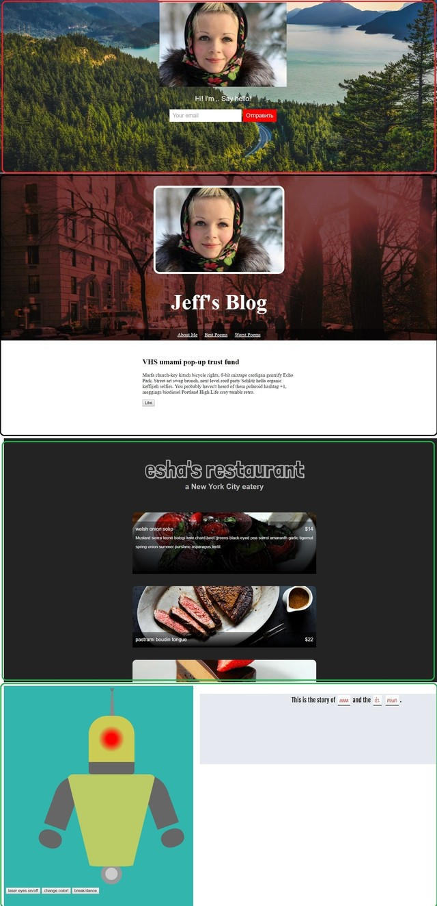

# Содержание:

1. [CSS3 Hover Effects](./hover.zip)

---

1. [Motion UI](./motion-ui.zip)

---

1. [Semantic UI](./semantic-ui.zip)

*User Interface is the language of the web*

---

1. [Zebra tooltips](./zebra-tooltips.zip)

---

1. [Popper.js](https://popper.js.org/)

---

1. [Tourist.js](https://github.com/easelinc/tourist)

*Tourist.js is a simple library for creating guided tours through your app.*

---

1. [Flexbox - 1](./flexbox)

1. [Flexbox - 2](./flexbox)

1. [Flexbox - 3](./flexbox)

---

1. [Awesome websites](https://dash.generalassemb.ly/)

*Dash teaches HTML, CSS, and Javascript through fun projects you can do in your browser.*

- [1 personal-page](./dash-website/1 personal-page)
- [2 responsive-blog-theme](./dash-website/2 responsive-blog-theme)
- [3 business-website](./dash-website/3 business-website)
- [4 css-robot](./dash-website/4 css-robot)
- [5 madlibs](./dash-website/5 madlibs)

---

