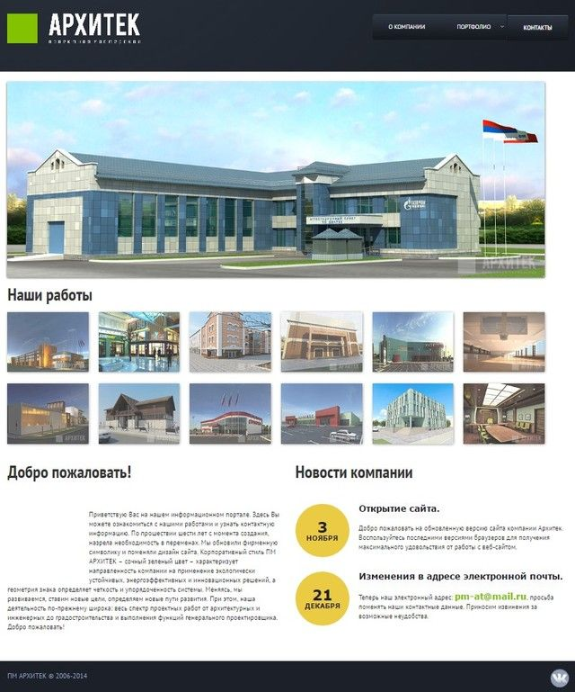

# Архивы проектов:

 

- [**http://l-food.ru/**](https://github.com/tsvetkovpro/l-food) - Лендинг для доставки еды в Оренбурге
- [**http://blog.l-food.ru/**](https://github.com/tsvetkovpro/l-food-blog) - Блог, для доставки еды в оренбурге

 

- [**Ekey.ru**](./ekey77.7z)

 
---
 

- [**Сайт портфолио Архитека**](./project-arch.zip)

 
---
 

- [**Телефонная книга компании**](./contacts-mtri.zip)

 
---
 

- [**3х мерная модель**](./vserod.7z)

 
---
 

- [**Книга контактов**](./demo-contact)

 
---
 

- [**Локальное хранилище**](./webstorage)

*Пример работы с локальным хранилищем броузера*

 
---
 

- [**Калькулятор пластиковых окон на javascript**](./js-windows-cost-calculator.zip)

 
---
 

- [**Мини-корзина**](./minibasket-master.zip)

 
---
 

#### [Перейти в начало](https://github.com/tsvetkovpro/sources#web-dev)

