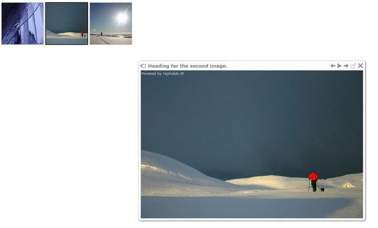

# Содержание:

 

1. [Эффект круговой навигации с CSS3](./circle-navigation-effect.zip)

---

2. [Гамма галерея](./gamma-gallery.zip)

---

4. [Простая галлерея](./simple-lightbox.zip)

*Дружественная к мобильным устройствам галлерея, с jQuery*

---

6. [Highslide JS](./high-slide.zip)

*Медиа галлерея написанная на JavaScript*

---

1. [Carousel (без JS)](https://github.com/DizzyZane/carousel-css)

")

---

1. [Simplezoom.js](https://github.com/chinchang/simplezoom.js)

*Маленькая JavaScript библиотека для превью картинок*

---

1. [Lightgallery.js](https://sachinchoolur.github.io/lightgallery.js/)

*JavaScript галлерея, с полным набором возможностей, без зависимостей*

#### [Перейти в начало](https://github.com/tsvetkovpro/sources#web-dev)
