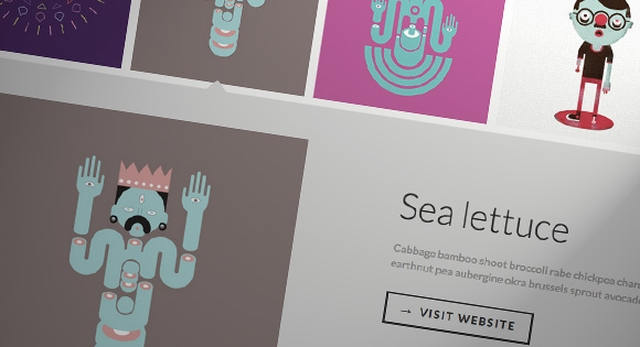

# Содержание:

 

- [D3.js - визуализация карты](./d3js-map-visualization.zip)

---

- [Morris.js - графики](http://morrisjs.github.io/morris.js/)

---

- [Панорама](./panorama.zip)

*Стройтельство блоков виртуальной реальности в вэб. работает на ПК, iOS, Android, очках виртуальной реальности Oculus Rift.* [Ссылка на проект](https://aframe.io/)

---

- [Сравнение продуктов](./product-comparison.zip)

---

- [Интерективные интерьер](./room-display.zip)

---

- [Вертикальная временная шкала](./vertical-timeline.zip)

---

- [Миниатюрная сетка с расширенным просмотром](./thumbnail-grid-expanding-preview.zip)

#### [Перейти в начало](https://github.com/tsvetkovpro/sources#web-dev)
